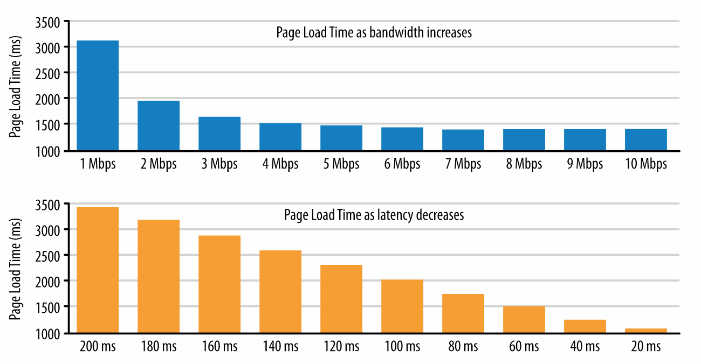

# HTTP

GET/POST/PATCH etc. are called _verbs_ in HTTP parlance

## History

* was invented by Tim Berners-Lee (same guy who thought up the WWW)
* was invented in 1991 (1 year older than I am!)
*

### Shortcomings of HTTP 0.9
* had no way to send media other than hypertext (i.e. no content negotiation)
* had no way of sending meta data about the requests (no headers)

By 1.0 there was content negotiation and request/response headers to provide
extra meta data to clients and servers.  It makes more sense to think of HTTP as
_hypermedia transport_ but the HTTP name happened to stick.

## What is it?

**Stages/steps**:
* DNS resolution
* TCP connection handshake
* TLS negotiation (if https)
* dispatch of HTTP request

Great visual representation as to why latency is often the bottleneck:

The main thing to take away from this diagram is that at a certain point more
bandwidth doesn't provide much speed increase.  If you're ISP is delivery ~5Mbps
then you're about maxed out on bandwidth speed bumps and it's more important to
focus on latency.  Decreasing latency has a far more profound impact on the
speed at which a website is loaded.

SPDY which later turned into HTTP/2's main goal is to help fix this latency
bottleneck.  Either we need to improve the roundtrip time or reduce the number
of roundtrips in order to speed things up...

**Head of line blocking**: is when you have a resource that is finished
processing on the server but can't be sent back to the client because there is a
response still processing ahead of it in the queue.  This occurs in HTTP/1.x.
Imagine request for HTML/CSS... if the CSS finishes but the HTML is still
processing the CSS just has to sit in a buffer until the HTML is finished and
then it can be flushed.

## Useful Headers 
`Content-Disposition` -  allows you to specify that a GET request should be returned as an attachment to be downloaded  

**PLT** - Page Load Time aka the time it takes for the `window.onload` to be
called.

## Useful Tools
* [Useful for testing website speed and see the waterfall in various browsers](https://www.webpagetest.org/)

### Domain Sharding

Since clients are limited to 6 TCP connections in parallel at a time there is a
technique to get around this called domain sharding.  DS means you can split up
the resources the client needs to fetch into many different domain names:
`shard1.example.com`, `shard2.example.com`, etc.

TCP connection pool is determined by the hostname and not IP, so these shards
could all be pointed at the same server (or some CDN) to get the parallelized
benefits.

**Note** domain sharding can actually hurt performance due to additional DNS
lookups, TCP slow start, and TLS handshakes.  It's important to take these into
consideration before going down this path. (pg. 203 hpbn has good info on this)

**Tip**: When to inline (use data URI's) --> if resource is small (>1-3KB) and
unique.  I.e won't appear on the page/website multiple times.  If the image is
bigger it could not render properly in older versions of IE and if it's a common
image you won't get cacheing benefits from putting it inline.

Base64 encoding encures a 33% byte overhead.  So technically, by inlining you
are adding more bytes to be sent down the wire.

### HTTP 2

Goals:
* reduce latency
* req/response multiplexing
* minimize protocol overhead via header compression
* request prioritization via server push

Keywords:

**stream**: a bidirectional flow of bytes within an established connection,
which may carry one or more messages.

**message**: a complete sequence of frames that map to a logical request or
response message.

**frame**: the smallest unit of communication in HTTP/2, each containing a frame
header, which at a minimum identifies the stream to which the frame belongs.

**multiplexing**: Multiplexing (or muxing) is a way of sending multiple signals
or streams of information over a communications link at the same time in the
form of a single, complex signal; the receiver recovers the separate signals, a
process called demultiplexing (or demuxing).

Streams are allowed to have dependencies and weights which allow the client to
form a 'prioritization tree'.  This allows servers to prioritize
CPU/bandwidth/memory/etc. to get the most important response to the client as
soon as possible.

**WOW**: due to these deps/weights we can even re-prioritize resources based
on user events... _what interesting things could I do with that?__
