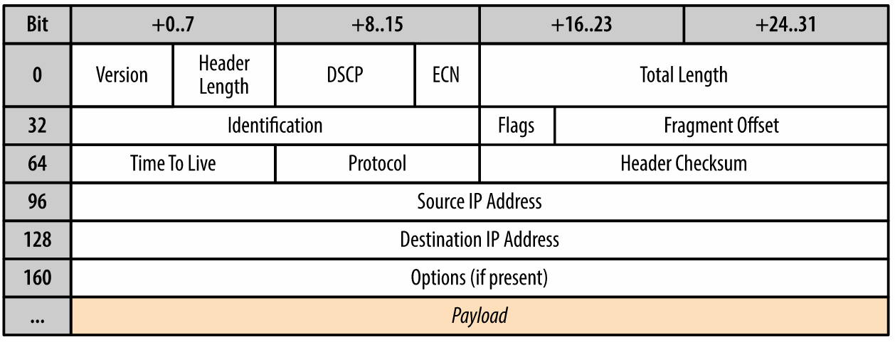

# IP - Internet Protocol

This is one layer below TCP/UDP.

The primary task of IP is to deliver datagrams from the source to destination.

IP doesn't concern itself with congestion, high load, or other issues.  It acts
more as interface that protocols built on top of it can then customize.  

Here is what the IP header looks like (20 bytes):

