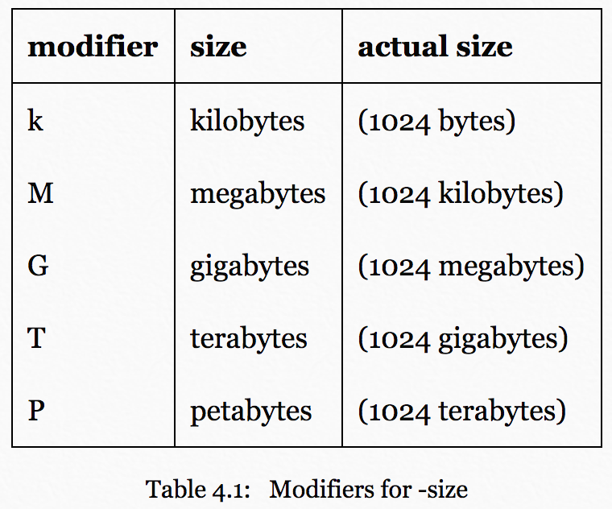

## mkdir

`mkdir -p` - allows you to make intermediary directories if they don't already
exist  

## | < >

`>` is used to write content to a file.  Ex: write all filenames with underscore
to a .txt file:

```sh
ls -a ~ | grep _ > underscores.txt
```

Alternatively, `<` can be used to read from a file and then you could pipe that
output into the input of another command.

Hooray unix!

## Ag

When using Ag you can pass in the -Q flag to look for exact patterns instead of
using the subset of regex that it provides. Ex:

Will look for all instances of .rb in the changlog.md file
```sh
ag -Q .rb railties/CHANGELOG.md

# without -Q would match something like turbolinks (urb)
ag .rb railties/CHANGELOG.md
```

`-l` flag will provide file names where your search is found
`-i` will make search case insensitive

You can pipe input into `Ag` to find something.  Ex:

find node process running on my machine
```sh
ps -e | ag node
```

## Curl - The Good Parts (tm)
`-i` flag to get more information about http response

```sh
curl -i quiet-waters-1228.herokuapp.com/hello 
```

`-O` flag is used to download files

```sh
curl -O http://quiet-waters-1228.herokuapp.com/assets/image.jpg
```

Capital O will use the filename found on the server.  If we want to rename the
file (which is pretty common) you can use the lowercase `-o` flag:

```sh
curl -o my_file.jpg <url-to-file>
```

`-X` flag can be used to change the HTTP method

When POSTing if you want to pass data along you can either:  

1.  Use string query params at the end of the url.  
2.  Use the `-d` flag to pass form data to the body of the request.  

```sh
curl -X POST -d "fname=Mark&lname=Bates" quiet-waters-1228.herokuapp.com/echo
```

One REALLY cool thing you can do is use a file for the .json form data by
prepending the filename with @:

```sh
curl -X POST -d @form_data.json quiet-waters-1228.herokuapp.com/echo
```

`-H` flag will let you set headers
`-u` flag will let you provider basic auth credentials in the request

## Find

Basic structure of a find command:
```sh
find PATH_TO_SEARCH OPTIONS_TO_USE PATTERN_TO_SEARCH_FOR
```

If you want to find based on patterns:
```sh
find . -name \*model.rb
```

You can also search based on a files path like this:
```sh
find . -path \*session\*
```

We can further refine these searches to find only files or directories:
```sh
find . -path \*session\* -type f
# or dir
find . -path \*session\* -type d
```

You can further refine searches with an AND query:
```sh
find . -path \*session\* -type f -name \*mem\*
```

Or if you don't want both to be true you can use an OR query:
```sh
find . \( -name \*.gemspec -or -name \*.jpg \) -type f
```

You can also use `-not` to match things that don't match your criteria:
```sh
find . -not -path \*t\* -type f
```

You can also adjust search by file size:
```sh
find . -size +200k
```

Modifiers for filesize:


